# Gatling-performance-test-starter

**English** | [中文](/README.md)

An introduction to using the gatling tool for performance testing, including environment setup, project initialization, examples, advanced usage, and more!

- [Gatling-performance-test-starter](#gatling-performance-test-starter)
  - [Gatling Introduction](#gatling-introduction)
  - [Environment setup](#environment-setup)
    - [VSCode + Gradle + Scala Version](#vscode--gradle--scala-version)
      - [Preparation](#preparation)
      - [install plugins](#install-plugins)
      - [official demo initialization \& debugging](#official-demo-initialization--debugging)
    - [VSCode + Maven + Scala version](#vscode--maven--scala-version)
      - [Preparation](#preparation-1)
      - [install plugins](#install-plugins-1)
      - [Official demo initialization \& debugging](#official-demo-initialization--debugging-1)
    - [IDEA + Gradle + Scala version](#idea--gradle--scala-version)
    - [IDEA + Maven + Scala version](#idea--maven--scala-version)
  - [Build your own Gatling project from 0 to 1](#build-your-own-gatling-project-from-0-to-1)
    - [Gradle + Scala versions](#gradle--scala-versions)
      - [Create an empty Gradle project](#create-an-empty-gradle-project)
      - [Configure the project build.gradle](#configure-the-project-buildgradle)
      - [gradle build project and initialize](#gradle-build-project-and-initialize)
      - [Initialization Directory](#initialization-directory)
      - [Writing Scripts](#writing-scripts)
      - [Debugging Scripts](#debugging-scripts)
    - [Maven + Scala version](#maven--scala-version)
      - [Create an empty Maven project](#create-an-empty-maven-project)
      - [Configure the project pom.xml](#configure-the-project-pomxml)
      - [Initialization Directory](#initialization-directory-1)
      - [Writing Scripts](#writing-scripts-1)
      - [Debugging Scripts](#debugging-scripts-1)
  - [Advanced Usage](#advanced-usage)
    - [Test report analysis](#test-report-analysis)
      - [Overview](#overview)
        - [Overall view](#overall-view)
        - [Response time ranges](#response-time-ranges)
        - [Summary](#summary)
        - [Active users over time](#active-users-over-time)
        - [Response time distribution](#response-time-distribution)
        - [Response time percentiles over time](#response-time-percentiles-over-time)
        - [Requests per second over time](#requests-per-second-over-time)
        - [Response per second over time](#response-per-second-over-time)
      - [Single request analysis report](#single-request-analysis-report)
    - [Performance Scenario Setting](#performance-scenario-setting)
      - [Injection](#injection)
        - [What is Injection](#what-is-injection)
        - [Common Injection Scenario](#common-injection-scenario)
          - [Open Model Scenario](#open-model-scenario)
          - [Closed Model Scenario](#closed-model-scenario)
        - [Meta DSL Scenario](#meta-dsl-scenario)
        - [Concurrent Scenario](#concurrent-scenario)
        - [Other Scenarios](#other-scenarios)
    - [CI/CD Integration](#cicd-integration)
      - [Accessing github action](#accessing-github-action)
        - [Gradle + Scala version](#gradle--scala-version)
        - [Maven + Scala version](#maven--scala-version-1)
    - [Recorder](#recorder)
  - [reference](#reference)

## Gatling Introduction

Gatling is an open source tool for performance and load testing, especially for testing web applications. It is a high-performance tool based on the Scala programming language for simulating and measuring the performance of applications under different loads.

Here are some of the key features and benefits of Gatling:

- Based on Scala programming language: Gatling's test scripts are written in Scala, which makes it a powerful programming tool that allows users to write complex test scenarios and logic.
- High Performance: Gatling is designed as a high performance load testing tool. It uses non-blocking I/O and an asynchronous programming model that is capable of simulating large numbers of concurrent users to better mimic real-world load situations.
- Easy to learn and use: Although Gatling's test scripts are written in Scala, its DSL (Domain Specific Language) is very simple and easy to learn. Even if you are not familiar with Scala, you can quickly learn how to create test scripts.
- Rich Features: Gatling provides a rich set of features, including request and response processing, data extraction, conditional assertions, performance report generation, and more. These features enable you to create complex test scenarios and perform comprehensive evaluation of application performance.
- Multi-Protocol Support: In addition to HTTP and HTTPS, Gatling supports other protocols such as WebSocket, JMS, and SMTP, making it suitable for testing a wide range of different types of applications.
- Real-time results analysis: Gatling provides real-time performance data and graphical reports during test runs to help you quickly identify performance issues.
- Open source and active community: Gatling is an open source project with an active community that constantly updates and improves the tool.
- CI/CD Integration Support: Gatling can be integrated with CI/CD tools such as Jenkins to perform performance testing in continuous integration and continuous delivery processes.

Overall, Gatling is a powerful performance testing tool for testing a wide range of application types, helping development teams identify and resolve performance issues to ensure consistent performance and scalability of applications in production environments.

## Environment setup

> Since I'm a macbook user, I'll use the macbook demo as an example in the introduction, but windows users can refer to it on their own.

### VSCode + Gradle + Scala Version

#### Preparation

- [x] Development tool: VSCode
- [x] Install Gradle version >= 6.0, I am using Gradle 8.44.
- [x] Install JDK version >= 8, I use JDK 19

#### install plugins

- [x] VSCode search for Scala (Metals) plugin for installation
- [x] VSCode search for Gradle for Java plugin for installation

#### official demo initialization & debugging

> We will use the official demo project for initialization and debugging first, and then we will introduce how to create your own project later.

- Clone the official demo project

```bash
git clone git@github.com:gatling/gatling-gradle-plugin-demo-scala.git
```

- Open the cloned official demo project with VSCode.

- Open the project's Terminal window with VSCode and execute the following command

```bash
gradle build
```

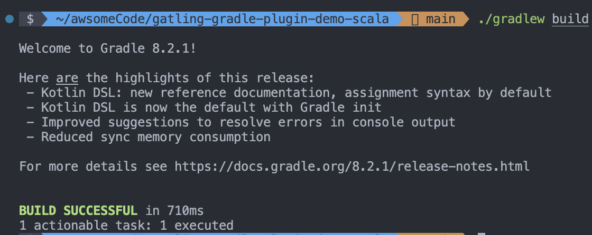

- Run the demo in the project

```bash
gradle gatlingRun
```

- Viewing the results of a command line run

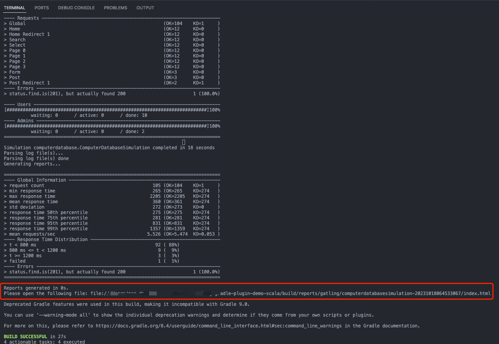

- Click on the html report link in the command line report and open it with your browser to view the detailed report information

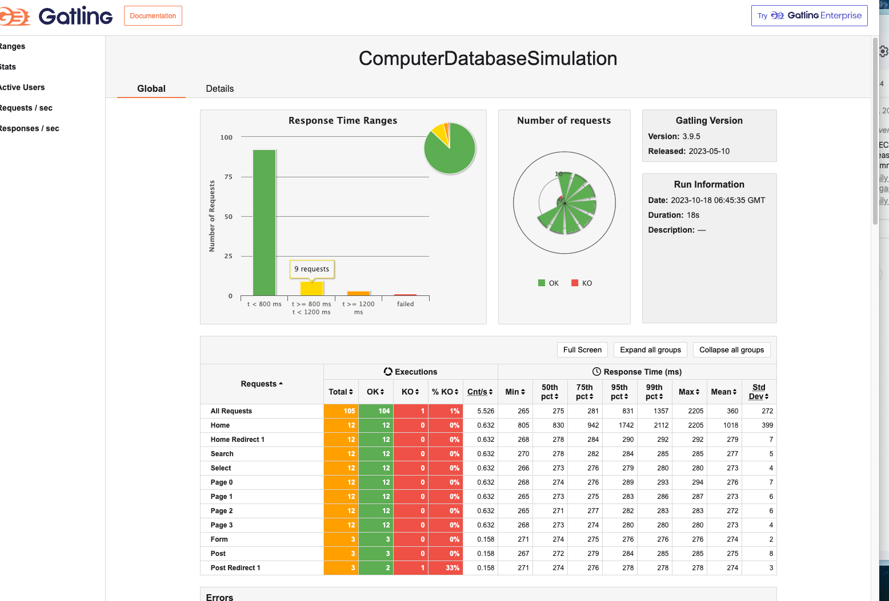

### VSCode + Maven + Scala version

#### Preparation

- [x] Development tool: VSCode
- [x] Install Maven, I use Gradle 8.44.
- [x] JDK version >= 8, I use JDK 19

#### install plugins

- [x] VSCode search for Scala (Metals) plugins to install
- [x] VSCode search for Maven for Java plugins to install

#### Official demo initialization & debugging

> We will use the official demo project for initialization and debugging first, and then we will introduce how to create your own project.

- Clone the official demo project

```bash
git clone git@github.com:gatling/gatling-maven-plugin-demo-scala.git
```

- Use VSCode to open the cloned official demo project.

- Open the Terminal window of this project with VSCode and execute the following command to run the demo in the project

```bash
mvn gatling:test
```

- Viewing the results of a command line run

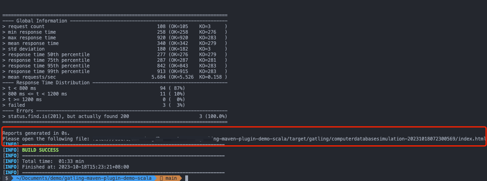

- Click on the html report link in the command line report and open it with your browser to view the detailed report information


### IDEA + Gradle + Scala version

This is similar to the VSCode version, so I won't repeat it here.

The differences are as follows:

- IDEA searches for Scala plugins to install
- New way to run: right click and select Engine.scala file in the project directory, select Run 'Engine' to run the demo (you need to press enter to confirm the run).

### IDEA + Maven + Scala version

This is similar to the VSCode version, so I won't repeat it here.

The differences are as follows:

- IDEA searches for Scala plugins to install
- New way to run: right-click the Engine.scala file in the project directory and select Run 'Engine' to run the demo (you need to press enter to confirm during the run).

## Build your own Gatling project from 0 to 1

### Gradle + Scala versions

#### Create an empty Gradle project

```bash
mkdir gatling-gradle-demo
cd gatling-gradle-demo
gradle init
```

#### Configure the project build.gradle

Add the following to the build.gradle file in the project

> You can copy the content of the build.gradle file in this project, for more configurations, please refer to the [official documentation](https://gatling.io/docs/gatling/reference/current/extensions/gradle_plugin/).

```groovy
// Plugin Configuration
plugins {
    id 'scala' // scala plugin declaration (based on the development tools plugin)
    id 'io.gatling.gradle' version '3.9.5.6' // declaration of the version of the gradle-based gatling framework plugin
}
// Repository source configuration
repositories {
  // Use the maven central repository source
  mavenCentral()
}
// gatling configuration
gatling {
  // logback root level, defaults to the Gatling console log level if logback.xml does not exist in the configuration folder
  logLevel = 'WARN' 

  // Enforce logging of HTTP requests at a level of detail
  // set to 'ALL' for all HTTP traffic in TRACE, 'FAILURES' for failed HTTP traffic in DEBUG
  logHttp = 'FAILURES' 

  // Simulations filter
  simulations = {
      include "**/simulation/*.scala"
  }
}
// Dependencies
dependencies {     
 // Charts library for generating report charts
 gatling 'io.gatling.highcharts:gatling-charts-highcharts:3.8.3'
 }
```

#### gradle build project and initialize

- Open the Terminal window of the project with an editor and execute the following command to confirm that the project build was successful

```bash
gradle build
```

- Initialization complete: After completing the wizard, Gradle will generate a basic Gradle project structure in the project directory
  
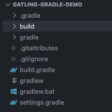

#### Initialization Directory
  
Create a simulation directory in the src/gatling/scala directory to hold test scripts

> Gatling tests are usually located in the src/gatling directory. You need to manually create the src directory in the project root, and then create the gatling directory under the src directory. In the gatling directory, you can create your test simulation folder simulation, as well as other folders such as data, bodies, resources, and so on.

#### Writing Scripts

- Create a demo.scala file in the simulation directory to write your test scripts.

- For reference, the following is a sample script

> The script contains two scenarios, one for get requests and one for post requests.
> The get interface validates that the interface returns a status code of 200 and the post interface validates that the interface returns a status code of 201.
> The get interface uses rampUsers, the post interface uses constantConcurrentUsers.
> rampUsers: incrementally increase the number of concurrent users over a specified period of time, constantConcurrentUsers: keep the number of concurrent users constant over a specified period of time.
> The number of concurrent users is 10 for both interfaces, and the duration is 10 seconds for both interfaces.
> The request interval is 2 seconds for both interfaces.

```scala
package simulation 

import scala.concurrent.duration._

import io.gatling.core.Predef._
import io.gatling.http.Predef._

class demo extends Simulation { 

  val httpProtocol = http
    .baseUrl("https://jsonplaceholder.typicode.com") // 5
  val scn = scenario("GetSimulation")
    .exec(http("get_demo") 
      .get("/posts/1")
      .check(status.is(200)))
    .pause(2)
  val scn1 = scenario("PostSimulation")
    .exec(http("post_demo")
      .post("/posts")
      .body(StringBody("""{"title": "foo","body": "bar","userId": 1}""")).asJson
      .check(status.is(201)))
    .pause(2)

  setUp( 
    scn.inject(rampUsers(10) during(10 seconds)),
    scn1.inject(constantConcurrentUsers(10) during(10 seconds))
  ).protocols(httpProtocol)
}
```

#### Debugging Scripts

Execute the following command to run the test script and view the report

```bash
gradle gatlingRun
```

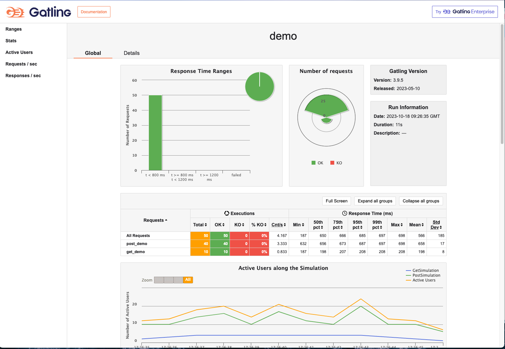

### Maven + Scala version

#### Create an empty Maven project

```bash
mvn archetype:generate -DgroupId=demo.gatlin.maven -DartifactId=gatling-maven-demo
```

Initialization complete: After completing the wizard, Maven will create a new project directory and generate a basic Maven project structure in the
  
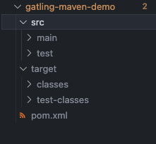

#### Configure the project pom.xml

Add the following contents to the pom.xml file in the project

> You can copy the contents of the pom.xml file in this project, for more configuration, please refer to the [official documentation](https://gatling.io/docs/gatling/reference/current/extensions/maven_plugin/).

```xml
<!-- dependencies Configuration -->
<dependencies>
  <dependency>
    <groupId>io.gatling.highcharts</groupId>
    <artifactId>gatling-charts-highcharts</artifactId>
    <version>3.9.5</version>
    <scope>test</scope>
  </dependency>
</dependencies>
<!-- Plugin Configuration -->
  <build>
    <plugins>
      <plugin>
        <groupId>io.gatling</groupId>
        <artifactId>gatling-maven-plugin</artifactId>
        <version>4.6.0</version>
      </plugin>
      <plugin>
        <groupId>net.alchim31.maven</groupId>
        <artifactId>scala-maven-plugin</artifactId>
        <version>4.8.1</version>
        <configuration>
          <scalaVersion>2.13.12</scalaVersion>
        </configuration>
        <executions>
          <execution>
            <goals>
              <goal>testCompile</goal>
            </goals>
            <configuration>
              <jvmArgs>
                <jvmArg>-Xss100M</jvmArg>
              </jvmArgs>
              <args>
                <arg>-deprecation</arg>
                <arg>-feature</arg>
                <arg>-unchecked</arg>
                <arg>-language:implicitConversions</arg>
                <arg>-language:postfixOps</arg>
              </args>
            </configuration>
          </execution>
        </executions>
      </plugin>
    </plugins>
  </build>
```

#### Initialization Directory
  
Create a simulation directory in the src/test/scala directory to hold the test scripts

> scala tests are usually located in the src/test directory. You need to create a scala directory under the project test directory. In the scala directory, you can create your test simulation folder simulation, as well as other folders such as data, bodies, resources, and so on.

#### Writing Scripts

- Create a demo.scala file in the simulation directory to write your test scripts.

- For reference, the following is a sample script

> The script contains two scenarios, one for get requests and one for post requests.
> The get interface validates that the interface returns a status code of 200 and the post interface validates that the interface returns a status code of 201.
> The get interface uses rampUsers, the post interface uses constantConcurrentUsers.
> rampUsers: incrementally increase the number of concurrent users over a specified period of time, constantConcurrentUsers: keep the number of concurrent users constant over a specified period of time.
> The number of concurrent users is 10 for both interfaces, and the duration is 10 seconds for both interfaces.
> The request interval is 2 seconds for both interfaces.

```scala
package simulation 

import scala.concurrent.duration._

import io.gatling.core.Predef._
import io.gatling.http.Predef._

class demo extends Simulation { 

  val httpProtocol = http
    .baseUrl("https://jsonplaceholder.typicode.com") // 5
  val scn = scenario("GetSimulation")
    .exec(http("get_demo") 
      .get("/posts/1")
      .check(status.is(200)))
    .pause(2)
  val scn1 = scenario("PostSimulation")
    .exec(http("post_demo")
      .post("/posts")
      .body(StringBody("""{"title": "foo","body": "bar","userId": 1}""")).asJson
      .check(status.is(201)))
    .pause(2)

  setUp( 
    scn.inject(rampUsers(10) during(10 seconds)),
    scn1.inject(constantConcurrentUsers(10) during(10 seconds))
  ).protocols(httpProtocol)
}
```

#### Debugging Scripts

Execute the following command to run the test script and view the report

```bash
mvn gatling:test
```


## Advanced Usage

### Test report analysis

#### Overview

##### Overall view

> Open the detailed html report after the performance test execution is finished;
> Your report can be analyzed by metrics, active users and requests/responses over time, as well as distributions

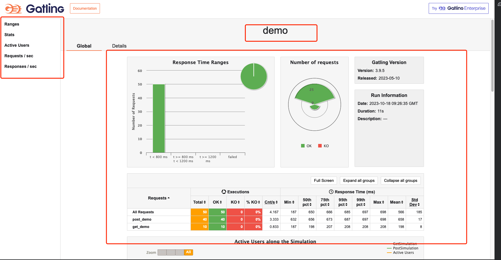

- The name of Simulation is displayed in the center of the page in the header
- The list on the left side shows a menu of different types of reports, which can be switched by clicking on them.
- The middle of the page shows an overview of the performance test report, including: total number of requests, total number of successful requests, total number of unsuccessful requests, shortest response time, longest response time, average response time, throughput, standard deviation, percentage distribution, etc. It also shows the version of gatling and the time and duration of this report. The version of gatling and the time and duration of this report run are also displayed.
- The Global menu points to aggregate statistics.
- The Details menu points to statistics for each request type.

##### Response time ranges

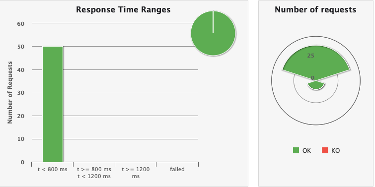

This chart shows the distribution of response times within the standard range
The list on the left shows all requests and the distribution of request response times, with the red color representing failed requests.
On the right, Number of requests represents the number of concurrent users, as well as the number of requests for each request and their success and failure status.

> These ranges can be configured in the gatling.conf file

##### Summary

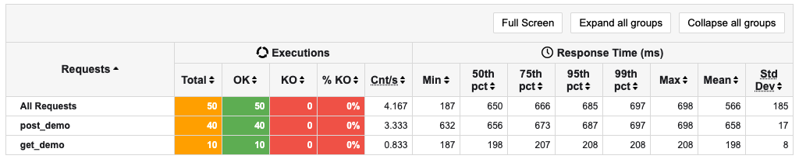

This chart shows some standard statistics such as minimum, maximum, average, standard deviation and percentile for global and per request.
stats shows the specific success and failure of all requests OK for success, KO for failure, and 99th pct for 99th percentile response time for total requests for this API.

> These percentiles can be configured in the gatling.conf file.

##### Active users over time

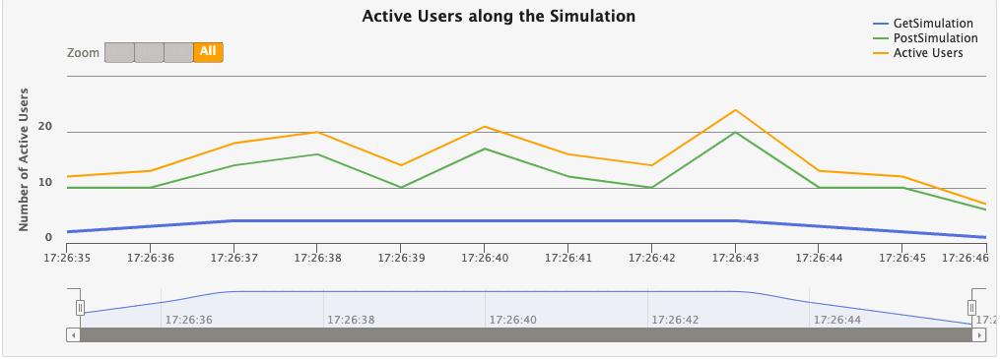

This chart shows that the number of active users refers to the number of users who are making requests during the test time period. At the beginning of the test, the number of active users is 0. When users start sending requests, the number of active users starts to increase. When a user completes a request, the number of active users begins to decrease. The maximum number of active users is the number of users sending requests at the same time during the test period.

##### Response time distribution

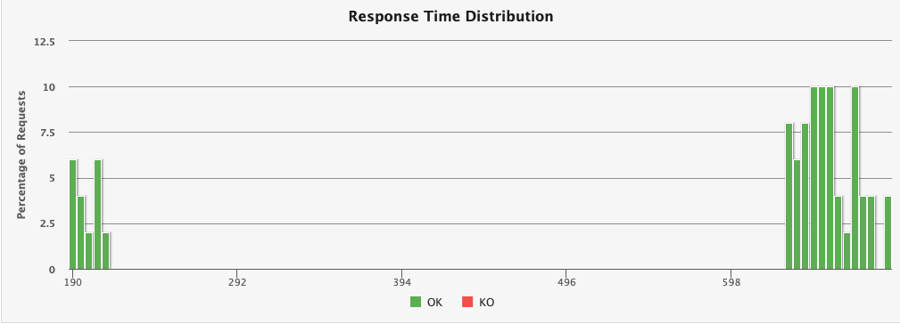

This chart shows the distribution of response times, including response times for successful requests and response times for failed requests.

##### Response time percentiles over time

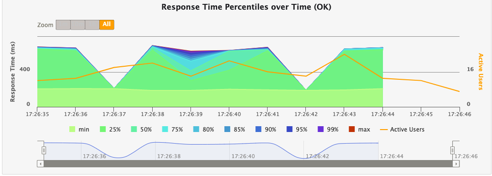

This chart shows various response time percentiles over time, but only for successful requests. Since failed requests may end early or be caused by timeouts, they can have a huge impact on the percentile calculation.

##### Requests per second over time

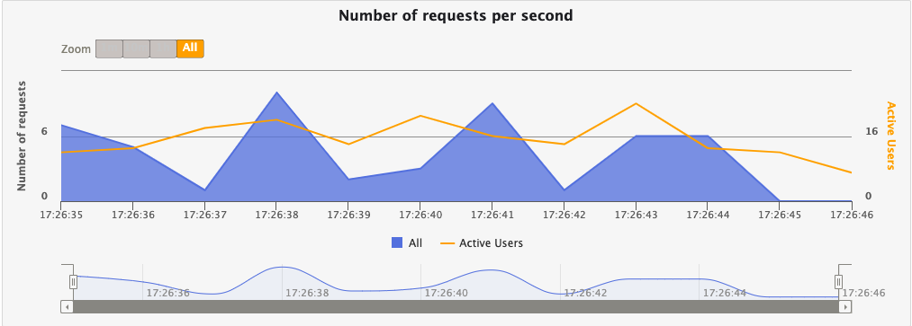

This chart shows the number of requests per second, including the number of successful requests and the number of failed requests.

##### Response per second over time

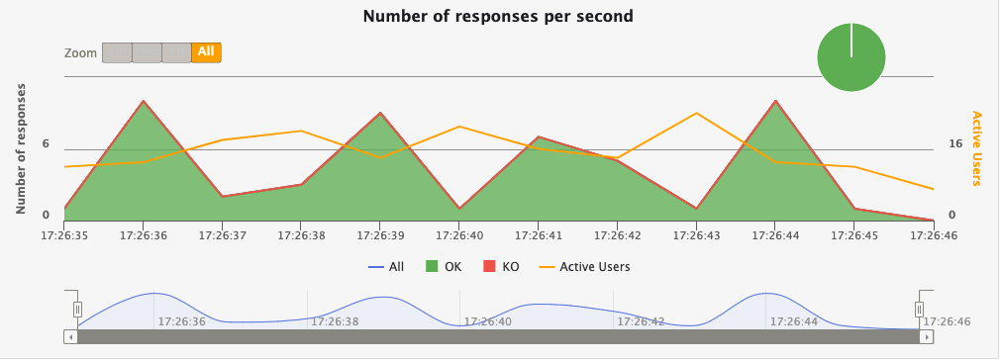

This chart shows the number of responses per second, including the number of successful responses and the number of failed responses.

#### Single request analysis report

> You can click the details menu on the report page to switch to the details tab and view a detailed report for a single request.


The Details page primarily shows per-request statistics, and similarly to the global report includes a graph of response time distribution, response time percentile, requests per second, and responses per second. The difference is that there is a graph at the bottom that depicts the response time of a single request relative to all requests globally. The horizontal coordinate of this graph is the number of all requests per second globally, and the vertical coordinate is the response time of a single request.

### Performance Scenario Setting

#### Injection

##### What is Injection

In Gatling performance testing, "Injection" refers to a method of introducing virtual users (or load) into the system. It defines how simulated users are introduced into a test scenario, including the number, rate, and manner of users.Injection is a key concept used in Gatling to control load and concurrency, allowing you to simulate different user behaviors and load models.

User injection profiles are defined using the injectOpen and injectClosed methods (inject in Scala). This method takes as arguments a sequence of injection steps that are processed sequentially. Each step defines a set of users and how these users are injected into the scene.

More from the web site: <https://gatling.io/docs/gatling/reference/current/core/injection/>

##### Common Injection Scenario

###### Open Model Scenario

```scala
setUp(
  scn.inject(
    nothingFor(4), // 1
    atOnceUsers(10), // 2
    rampUsers(10).during(5), // 3
    constantUsersPerSec(20).during(15), // 4
    constantUsersPerSec(20).during(15).randomized, // 5
    rampUsersPerSec(10).to(20).during(10.minutes), // 6
    rampUsersPerSec(10).to(20).during(10.minutes).randomized, // 7
    stressPeakUsers(1000).during(20) // 8
  ).protocols(httpProtocol)
)
```

1. nothingFor(duration): set a period of time to stop, this time to do nothing
2. atOnceUsers(nbUsers): immediately inject a certain number of virtual users
3. rampUsers(nbUsers) during(duration): set a certain number of virtual users to be injected gradually during a specified period of time.
4. constantUsersPerSec(rate) during(duration): Define a constant number of concurrent users per second for a specified period of time.
5. constantUsersPerSec(rate) during(duration) randomized: defines a randomized concurrency increase/decrease around a specified number of concurrencies per second, for a specified period of time
6. rampUsersPerSec(rate1) to (rate2) during(duration): defines a concurrency interval that runs for the specified time, with the concurrency growth period being a regular value.
7. rampUsersPerSec(rate1) to (rate2) during(duration) randomized: define a concurrency interval, run for a specified time, the concurrency growth period is a random value
8. stressPeakUsers(nbUsers).during(duration) : injects a given number of users according to a smooth approximation of a [step function](https://en.wikipedia.org/wiki/Heaviside_step_function) that stretches to a given duration. users.

###### Closed Model Scenario

```scala
setUp(
  scn.inject(
    constantConcurrentUsers(10).during(10), // 1
    rampConcurrentUsers(10).to(20).during(10) // 2
  )
)
```

1. constantConcurrentUsers(fromNbUsers).during(duration) : inject to make the number of concurrent users in the system constant
2. rampConcurrentUsers(fromNbUsers).to(toNbUsers).during(duration) : inject so that the number of concurrent users in the system increases linearly from one number to the next

##### Meta DSL Scenario

"Meta DSL is a special Domain Specific Language (DSL) for describing the metadata and global configuration of performance test scenarios.Meta DSL allows you to define a number of global settings and parameters in a performance test that affect the entire test process, rather than being specific to a particular scenario.

The elements of the Meta DSL can be used to write tests in a simpler way. If you want to link levels and ramps to reach the limits of your application (a test sometimes referred to as a capacity load test), you can do this manually using the regular DSL and looping with map and flatMap.


- incrementUsersPerSec

```scala
setUp(
  // Generate an open workload injection profile
  // 10, 15, 20, 25 and 30 users arrive every second
  // Each level lasts 10 seconds
  // Each level lasts 10 seconds
  scn.inject(
    incrementUsersPerSec(5.0)
      .times(5)
      .eachLevelLasting(10)
      .separatedByRampsLasting(10)
      .startingFrom(10) // Double
  )
```

- incrementConcurrentUsers
  
```scala
setUp(
  // Generate a closed workload injection profile
  // Concurrent users at levels 10, 15, 20, 25, and 30
  // Each level lasts 10 seconds
  // Each level lasts 10 seconds
  scn.inject(
    incrementConcurrentUsers(5)
      .times(5)
      .eachLevelLasting(10)
      .separatedByRampsLasting(10)
      .startingFrom(10) // Int
  )
)
```

incrementUsersPerSec is used for open workloads, incrementConcurrentUsers is used for closed workloads (users/sec vs concurrent users).

separatedByRampsLasting and startingFrom are both optional. If you do not specify a ramp, the test jumps from one level to another as soon as it finishes. If you do not specify the number of starting users, the test will start with 0 concurrent users or 0 users per second and move to the next step immediately.

##### Concurrent Scenario

```scala
setUp(
  scenario1.inject(injectionProfile1),
  scenario2.inject(injectionProfile2)
)
```

You can configure multiple scenes to start simultaneously and execute concurrently in the same setUp block.

##### Other Scenarios

Check out the website: <https://gatling.io/docs/gatling/reference/current/core/injection/>

### CI/CD Integration

#### Accessing github action

Take github action as an example, and other CI tools as well.

##### Gradle + Scala version

> See the demo at <https://github.com/Automation-Test-Starter/gatling-gradle-scala-demo>.

- Create the .github/workflows directory: In your GitHub repository, create a directory called .github/workflows. This will be where the GitHub Actions workflow files will be stored.

- Create the workflow file: Create a YAML-formatted workflow file, such as gatling.yml, in the .github/workflows directory.
- Edit the gatling.yml file: Copy the following into the file.

```yaml
name: Gatling Performance Test

on:
  push:
    branches:
      - main

jobs:
  performance-test:
    runs-on: ubuntu-latest

    steps:
      - name: Checkout code
        uses: actions/checkout@v2

      - name: Set up Java
        uses: actions/setup-java@v2
        with:
          java-version: 11
          distribution: 'adopt'

      - name: Run Gatling tests
        run: |
          ./gradlew gatlingRun
        env:
          GATLING_SIMULATIONS_FOLDER: src/gatling/scala

      - name: Archive Gatling results
        uses: actions/upload-artifact@v2
        with:
          name: gatling-results
          path: build/reports/gatling

      - name: Upload Gatling results to GitHub
        uses: actions/upload-artifact@v2
        with:
          name: gatling-results
          path: build/reports/gatling
```

- Commit the code: Add the gatling.yml file to your repository and commit.
- View the test report: In GitHub, navigate to your repository. Click the Actions tab at the top and then click the Performance Test workflow on the left. You should see the workflow running, wait for the execution to complete and you can view the results.

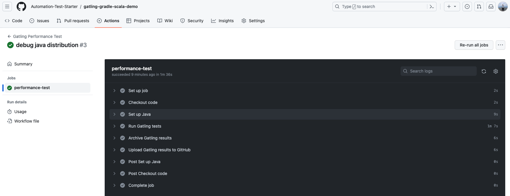

##### Maven + Scala version

> See the demo at <https://github.com/Automation-Test-Starter/gatling-maven-scala-demo>

- Create the .github/workflows directory: In your GitHub repository, create a directory called .github/workflows. This will be where the GitHub Actions workflow files will be stored.

- Create the workflow file: Create a YAML-formatted workflow file, such as gatling.yml, in the .github/workflows directory.
- Edit the gatling.yml file: Copy the following into the file.

```yaml
name: Gatling Performance Test

on:
  push:
    branches:
      - main

jobs:
  performance-test:
    runs-on: ubuntu-latest

    steps:
      - name: Checkout code
        uses: actions/checkout@v2

      - name: Set up Java
        uses: actions/setup-java@v2
        with:
          java-version: 11
          distribution: 'adopt'

      - name: Run Gatling tests
        run: |
          mvn gatling:test
        env:
          GATLING_SIMULATIONS_FOLDER: src/test/scala

      - name: Archive Gatling results
        uses: actions/upload-artifact@v2
        with:
          name: gatling-results
          path: target/gatling

      - name: Upload Gatling results to GitHub
        uses: actions/upload-artifact@v2
        with:
          name: gatling-results
          path: target/gatling
```

- Commit the code: Add the gatling.yml file to your repository and commit.
- View the test report: In GitHub, navigate to your repository. Click the Actions tab at the top and then click the Performance Test workflow on the left. You should see the workflow running, wait for the execution to complete and you can view the results.

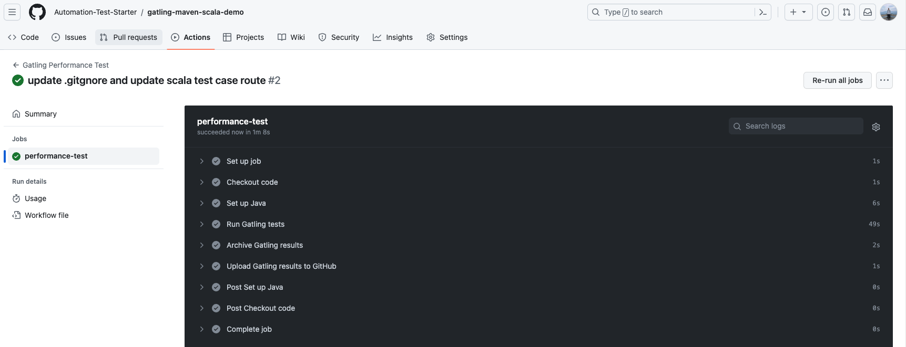

### Recorder

> To be completed

## reference

- galting official website: <https://gatling.io/>
- galting official documentation: <https://gatling.io/docs/gatling/>
- galting official github: <https://github.com/gatling/>
